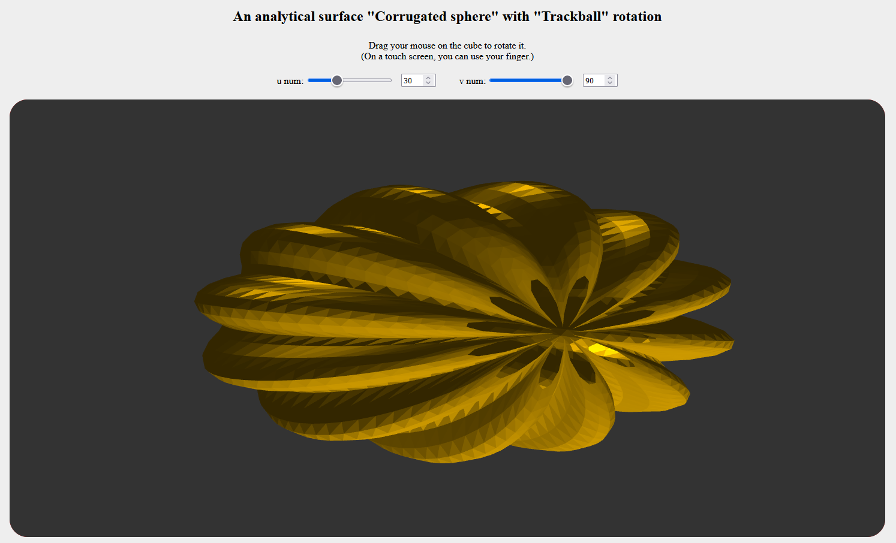
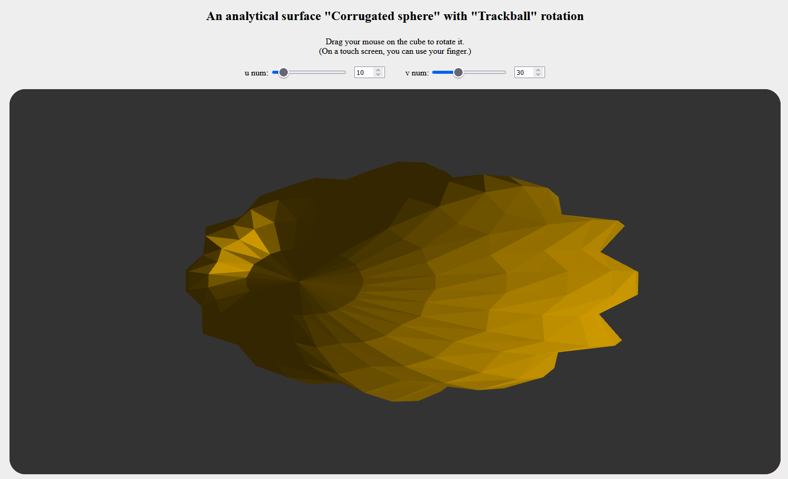

# WebGL

The project includes practical assignments for the VGGI credit module (https://vggi-kpi.blogspot.com).

It is based on the project in the ademch/WebGL repository (https://github.com/ademch/WebGL).

# PA2 

